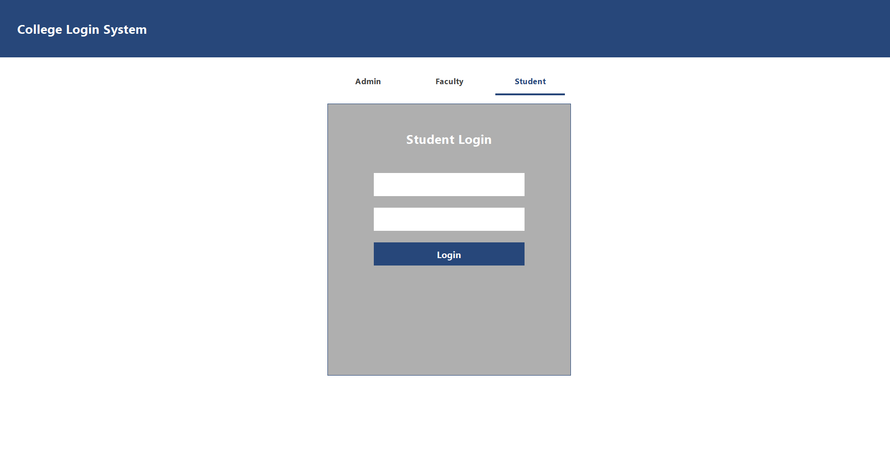

# 🎓 College Management System 

A **Java Swing–based desktop application** developed to streamline and manage core college administrative operations.  
This project is designed for **academic use**, demonstrating Java GUI development, database connectivity, and modular software design.

---
<!--
## 📌 Overview

The College Management System provides a simple yet extensible platform for managing administrative workflows such as authentication and admin-level operations. It uses **MySQL** as the backend database and follows a clean **package-based structure** suitable for academic evaluation and GitHub presentation.

---

## ✨ Features

- 🔐 Secure login system
- 🧑‍💼 Admin dashboard
- 🗄️ MySQL database integration using JDBC
- 🖥️ Desktop GUI built with Java Swing
- 📸 UI screenshots included for preview
- 🧱 Modular and readable code structure

---

<!--## 🛠️ Tech Stack

| Layer | Technology |
|-----|-----------|
| Language | Java |
| UI | Java Swing |
| Database | MySQL |
| Connectivity | JDBC (MySQL Connector/J 8.4.0) |
| IDE | IntelliJ IDEA |

---
-->
## 📂 Recommended Project Structure

> This structure is **ideal for GitHub and college submissions**.  
> Avoid pushing compiled files (`.class`) or IDE configs.

```
College_Management_System/
│
├── src/
│   └── college/
│       ├── login/
│       │   ├── LoginPanel.java
│       │   └── LoginPageFrame.java
│       │
│       ├── admin/
│       │   ├── AdminMain.java
│       │   └── AdminData.java
│       │
│       └── libs/
│           ├── DataBaseConnection.java
│           └── TestConnection.java
│
├── screenshots/
│   ├── login.png
│   ├── admin_dashboard.png
│   └── database_view.png
│
├── jar/
│   └── mysql-connector-j-8.4.0.jar
│
├── README.md
└── .gitignore
```
<!--
---

## 🧩 How to Organize the Project (IntelliJ IDEA)

1. Create a `src` directory in the project root
2. Inside `src`, create package `college`
3. Add sub-packages:
   - `college.login`
   - `college.admin`
   - `college.libs`
4. Move `.java` files into their respective packages
5. Create a `screenshots` folder and add UI images
6. Exclude:
   - `out/`
   - `.class` files
   - `.idea/`
-->
---

## 🖼️ Screenshots

### 🔐 Login Page

<!--
### 🧑‍💼 Admin Dashboard


### 🗄️ Database View

-->
---

## ⚙️ Installation & Setup

### Prerequisites
- Java JDK 8 or above
- MySQL Server
<!--- IntelliJ IDEA (recommended)-->

### Steps
1. Clone the repository:
   ```bash
   git clone https://github.com/AyusmanNanda/College_Management_system.git
   ```
2. Open the project
3. Add `mysql-connector-j-8.4.0.jar` to project libraries
4. Create a MySQL database (e.g., `collegedata`) or import sql/collegedata.sql to replicate the database.
5. Update DB credentials in `DataBaseConnection.java`
6. Run `LoginPageFrame.java`

---

## 🧪 Database Details

- Database Name: `collegedata`
- Connection handled via JDBC
- Credentials configured in:
  ```
  college.libs.DataBaseConnection
  ```

---

<!--## 🔮 Future Enhancements

- 👨‍🎓 Student management module
- 👩‍🏫 Faculty management
- 📊 Attendance & result tracking
- 🔑 Role-based access control
- 🧠 MVC architecture refactor
- 🌐 Web-based version (Spring Boot)

---

## 🎓 Academic Relevance

This project is suitable for:
- DBMS Mini / Major Project
- Java Programming Course
- Software Engineering Lab
- Internship Portfolio

---
-->
## 🤝 Contribution Guidelines

This project is intended for educational purposes.  
Enhancements and refactors are welcome via pull requests.

---

## 📜 License

This project is licensed for **educational and non-commercial use only**.
